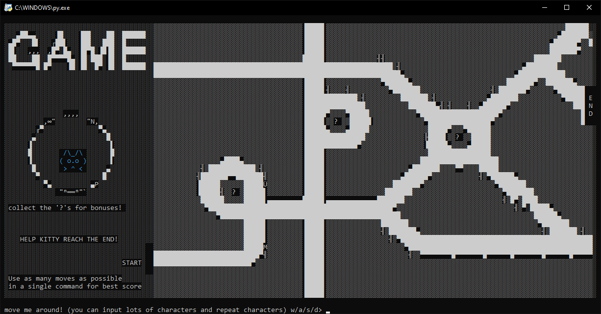

# effectively-kitty
A text-based game made in python. 
Needs colorama.
Run in console only, not in IDLE.

For correct renedring of colors, you need to have e specific registry entry which enables it.
You can use 'enablecolor.reg' provided in this repo (to install you simply double click on it.)

## how to play

every character (w,a,s,d) is considered as a single move. To execute, you have to press enter. This is a command.
For best scores, you need to have as many moves as possible in a single command. Less than 5 moves in one command result in negative scores.

## Update

 - fixed a few bugs
 - win system is now in place
 - added an easter egg
